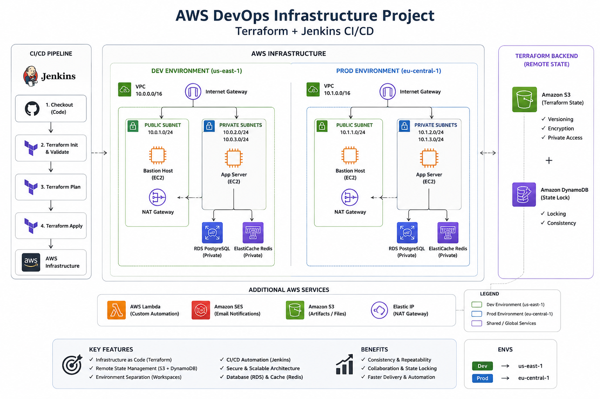

# AWS DevOps Infrastructure Project

A hands-on DevOps project implementing AWS infrastructure with Terraform and automating infrastructure deployment using Jenkins CI/CD.

The project demonstrates Infrastructure as Code, remote Terraform state management, environment separation, CI/CD automation, secure credential handling, database and caching services, and application deployment.

## Architecture

The project uses two Terraform environments:

- **Dev** → `us-east-1`
- **Prod** → `eu-central-1`

Each environment is managed using a separate Terraform workspace.

## Architecture Diagram




### Main Components

- VPC
- Public Subnet
- Private Subnets
- Internet Gateway
- NAT Gateway
- Public and Private Route Tables
- Bastion Host
- Private Application EC2
- RDS PostgreSQL
- ElastiCache Redis
- Security Groups

## AWS Services

The project uses the following AWS services:

- Amazon VPC
- Amazon EC2
- Amazon RDS PostgreSQL
- Amazon ElastiCache for Redis
- Amazon S3
- Amazon DynamoDB
- AWS Lambda
- Amazon SES
- Internet Gateway
- NAT Gateway
- Elastic IP

## Infrastructure as Code

Terraform is used to provision and manage the AWS infrastructure.

The infrastructure includes:

- VPC
- Public and Private Subnets
- Route Tables
- Route Table Associations
- Internet Gateway
- NAT Gateway
- Elastic IP
- Security Groups
- Bastion EC2
- Application EC2
- RDS PostgreSQL
- ElastiCache Redis

## Terraform Workspaces

Terraform workspaces are used to separate environments.

### List Workspaces


```bash
terraform workspace list

Available environments:

- `dev`
- `prod`


### Dev Environment

Region: `us-east-1`
VPC CIDR: `10.0.0.0/16`


### Prod Environment

Region: `eu-central-1`
VPC CIDR: `10.1.0.0/16`


Environment-specific variables are stored locally in:

`dev.tfvars`
`prod.tfvars`

These files are ignored by Git to prevent sensitive information from being committed.

Example files are provided:

- `dev.tfvars.example`
- `prod.tfvars.example`

## Terraform Remote Backend

Terraform state is stored remotely in Amazon S3.

The backend uses:

- Amazon S3 for remote state storage
- S3 encryption
- S3 versioning
- DynamoDB for state locking


This provides centralized state management and helps prevent concurrent Terraform operations from modifying the state simultaneously.

## Security Groups

### Bastion Security Group

Allows SSH access on port `22` from `0.0.0.0/0`.

### Application Security Group

Allows SSH access on port `22` and application traffic on port `3000` from the VPC CIDR.

## Database Security Group

RDS PostgreSQL is accessible only from the Application Security Group on port `5432`.

## Redis Security Group

ElastiCache Redis is accessible only from the Application Security Group on port `6379`.

## EC2 Architecture

The project uses a Bastion Host architecture.


```text
Internet
   |
   v
Bastion Host
Public Subnet
   |
   | SSH
   v
Application EC2
Private Subnet
   |
   +------> RDS PostgreSQL
   |
   +------> ElastiCache Redis

```

```

## RDS PostgreSQL

Amazon RDS PostgreSQL is used as the relational database.

Configuration includes:

- PostgreSQL
- Private subnet group
- Two private subnets
- Encrypted storage
- `db.t3.micro`
- 20 GB gp3 storage
- No public access

Database access is restricted through a dedicated Security Group.


## ElastiCache Redis

Amazon ElastiCache for Redis is used as the caching layer.

Configuration includes:

- Redis
- `cache.t3.micro`
- One cache node
- Port `6379`
- Private subnet group
- Dedicated Security Group

Redis access is restricted to the Application Security Group.


## Jenkins CI/CD

Jenkins is used to automate Terraform infrastructure deployment.

Jenkins runs inside Docker using a custom image containing:

- Jenkins
- Terraform
- AWS CLI
- Git

### Jenkins Pipeline

The pipeline includes the following stages:

```text
Prepare Variables
       |
       v
Terraform Init
       |
       v
Select Workspace
       |
       v
Terraform Validate
       |
       v
Terraform Plan
       |
       v
Terraform Apply
       |
       v
Deploy Node.js App


The Jenkins pipeline is parameterized using:

ENV = dev
ENV = prod

This allows the same pipeline to manage different Terraform environments.

## Jenkins Credentials

Sensitive information is managed using Jenkins Credentials instead of being hardcoded in the pipeline.

The project uses Jenkins Credentials for:

- AWS credentials
- RDS database password
- EC2 SSH private key

The RDS password is injected into a temporary `terraform.tfvars` file during the pipeline execution.

The temporary file is removed after the pipeline finishes.


## Node.js Application

A simple Node.js application is deployed to the private Application EC2.

The application listens on port `3000`.

Application code:

```javascript
const http = require('http');

const server = http.createServer((req, res) => {
  res.writeHead(200, { 'Content-Type': 'text/plain' });
  res.end('Hello from Node.js Application EC2!\n');
});

server.listen(3000, '0.0.0.0', () => {
  console.log('Server running on port 3000');
});

```

Jenkins deploys the application to the private Application EC2 through the Bastion Host using SSH.


```
## Terraform State Change Notification

The project implements an automated notification system for Terraform state changes.

### Flow

```text
Terraform
   |
   v
Amazon S3
   |
   | State Change
   v
AWS Lambda
   |
   | Send Email
   v
Amazon SES
   |
   v
Email Notification

```

The system uses:

- Amazon S3
- AWS Lambda
- Amazon SES

When the Terraform state changes in the S3 bucket, an S3 event triggers the Lambda function, which sends an email notification through Amazon SES.

## Project Structure

```text
terraform-project/
│
├── architecture.png
├── app.js
├── backend.tf
├── provider.tf
├── variables.tf
├── vpc.tf
├── security.tf
├── ec2.tf
├── nat.tf
├── rds.tf
├── elasticache.tf
├── outputs.tf
│
├── dev.tfvars.example
├── prod.tfvars.example
│
├── Dockerfile
├── Jenkinsfile
├── .gitignore
└── .terraform.lock.hcl


## Terraform Commands

Initialize Terraform:

```bash
terraform init
```
Validate the configuration:

```bash
terraform validate
```
Select the Dev workspace:

```bash
terraform workspace select dev
```
Plan the Dev environment:

```bash
terraform plan -var-file=dev.tfvars
```
Apply the Dev environment:

```bash
terraform apply -var-file=dev.tfvars
```
Select the Prod workspace:

```bash
terraform workspace select prod
```
Plan the Prod environment:

```bash
terraform plan -var-file=prod.tfvars
```

Apply the Prod environment:

```bash
terraform apply -var-file=prod.tfvars
```
Destroy an environment:

```bash
terraform destroy -var-file=dev.tfvars
terraform destroy -var-file=prod.tfvars
```


## Cleanup

After completing the project, the Dev and Prod infrastructure was destroyed using Terraform.

This included:

- EC2 instances
- RDS PostgreSQL
- ElastiCache Redis
- NAT Gateway
- Elastic IP
- VPC
- Subnets
- Route Tables
- Internet Gateway
- Security Groups

The Terraform state was verified after destruction to ensure that no managed resources remained in the environments.


## Security Considerations

Sensitive Terraform variable files are excluded from Git:

```gitignore
*.tfvars

```

Only example variable files are committed.

AWS credentials, the RDS password, and the EC2 SSH private key are managed through Jenkins Credentials.

Terraform state is stored remotely in an encrypted S3 bucket.

The Application EC2, RDS, and Redis are deployed in private subnets and are not directly exposed to the Internet.

For a production environment, secrets should preferably be managed using AWS Secrets Manager or another dedicated secret-management solution.


## Conclusion

This project demonstrates a complete DevOps workflow using AWS, Terraform, and Jenkins.

It covers:

- Infrastructure as Code with Terraform
- Multi-environment infrastructure using Terraform Workspaces
- Remote Terraform state with Amazon S3
- State locking with DynamoDB
- AWS networking and security
- EC2 deployment using a Bastion Host
- RDS PostgreSQL
- ElastiCache Redis
- Jenkins CI/CD automation
- Secure credential management
- Node.js application deployment
- Automated Terraform state change notifications using S3, Lambda, and SES

The project was fully tested and the Dev and Prod infrastructure was successfully destroyed after completion.


